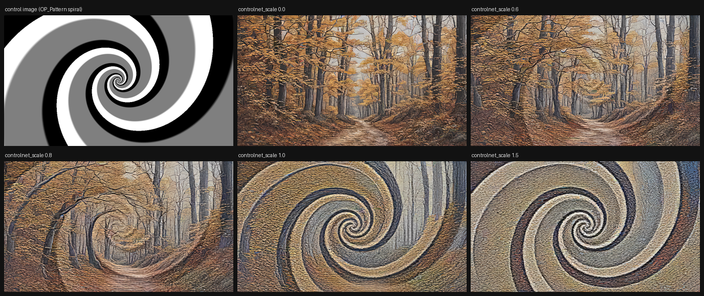
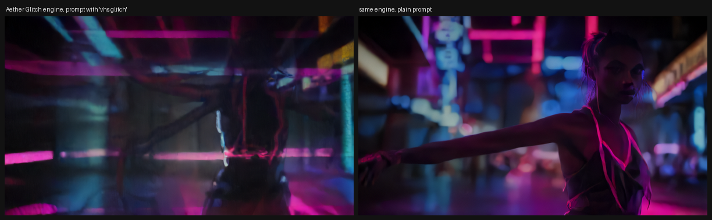
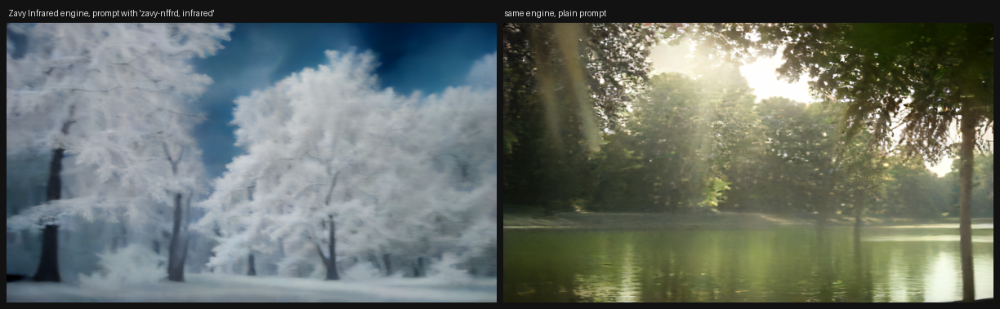
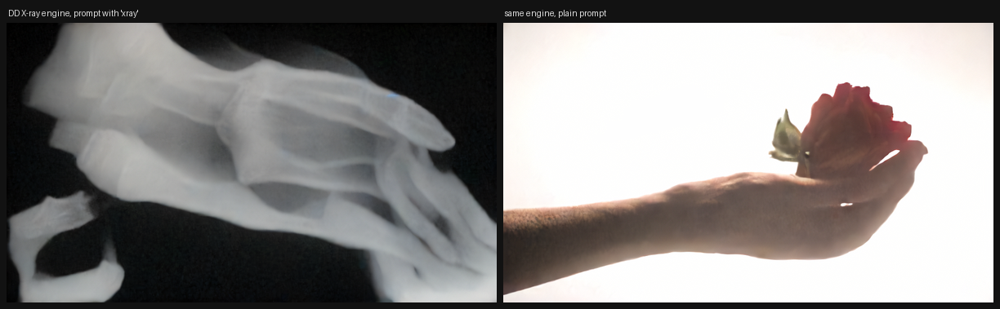
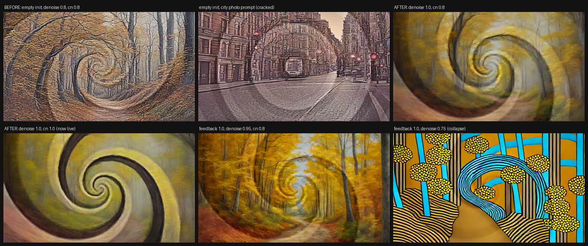
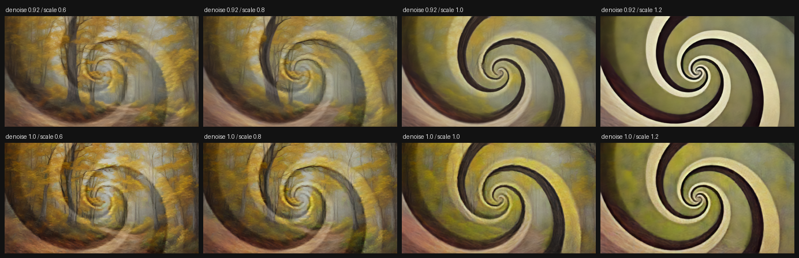
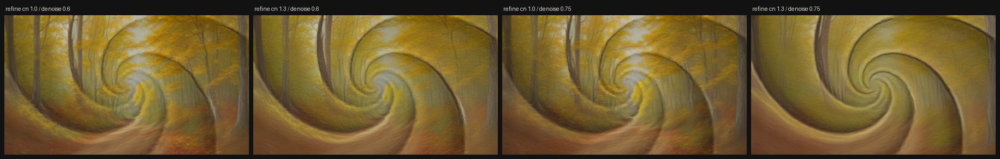
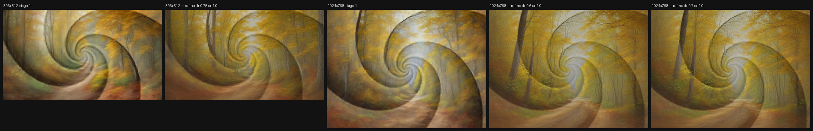
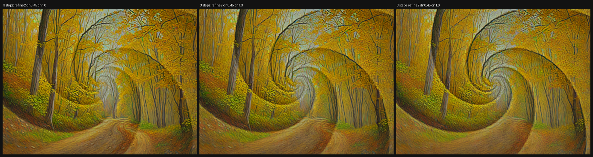
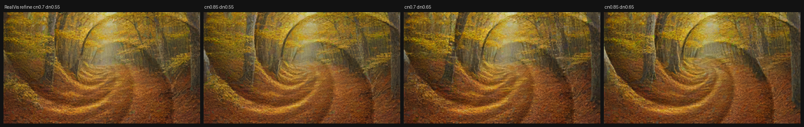

# OpticalPattern ControlNet for Sentinel StreamDiff

Real-time optical illusions in [Sentinel](https://sentinel.oodlabs.com): the SDXL
**OpticalPattern** ControlNet ([Civitai 161132](https://civitai.com/models/161132), v10e by
nacholmo) fused into Sentinel's SDXL-Turbo + IP-Adapter UNet as a custom TensorRT engine, plus
the Sentinel project that drives it from a live camera at 896x512 and roughly 15 to 30 fps.



*Spiral control image and the live output at ControlNet scale 0, 0.6, 0.8, 1.0 and 1.5.*

The ControlNet conditions only the darkest quarter and brightest quarter of the control image
and leaves the mid tones free, so any prompt can be bent around a hidden figure. This repo
contains everything needed to rebuild the engine on your own GPU, the graph that feeds it, the
measurements behind the tuning defaults, and a link to a prebuilt engine for RTX 50-series cards.

Prebuilt engine and demo recordings: **https://huggingface.co/Jamesbass/sentinel-opticalpattern-controlnet**

## Contents

| Path | What |
|---|---|
| `opticalpattern_controlnet.sentinel` | The show: Camera -> OP_Pattern -> OP_Diffusion, with tuning presets |
| `modules/OP_Pattern/` | Control-image Module: live three-tone percentile split of the camera, or spiral / rings / stripes / checker generators, histogram monitor, control outputs |
| `modules/_shared/plan_theme.hlsli` | Vendored instrument palette used by the monitor output |
| `contract/` | Sentinel's StreamDiff engine binding contract (`CONTRACT.md`, `bindings.json`, `dump_bindings.py`) |
| `export/export_fused_unet.py` | Fused UNet + ControlNet + IP-Adapter (+ optional LoRA) ONNX export with Sentinel's binding names |
| `export/build_engine.py` | TensorRT build with the static 896x512 profile and engine-vs-PyTorch verification |
| `export/install_custom_pack.py` | Copies an engine into Sentinel's custom profile folder and registers the pack |
| `export/identify_base_unet.py` | How the base UNet was identified as SDXL-Turbo |
| `export/run_lora_engines.cmd` | Detached batch: export + build one IP-Adapter engine per LoRA |
| `docs/` | Proof images, notes, correspondence draft |
| `AGENTS.md` | Rules for AI agents working in this repo |
| `PLAN.md` | The phased plan this project followed |

## Requirements

- Sentinel 0.5.66 or newer (custom engine packs, `engine_profile` parameter).
- To run the prebuilt engine: an NVIDIA RTX 50-series GPU (Blackwell, sm120) with at least
  16 GB VRAM. TensorRT plans do not transfer between GPU architectures.
- To build your own: Python 3.11+, CUDA 12.8, the packages in `export/requirements.txt`
  (TensorRT must match Sentinel's `nvinfer_10.dll`, 10.15.1 for 0.5.66), about 40 GB of
  disk for weights and ONNX, and 30 to 60 minutes of build time.

## Quick start with the prebuilt engine (RTX 50-series)

1. Download `unet_controlnet_union_ipadapter_fp16.engine` (8.4 GB) from the model repo on
   Hugging Face: `Jamesbass/sentinel-opticalpattern-controlnet` (https://huggingface.co/Jamesbass/sentinel-opticalpattern-controlnet).
2. Install it as a custom pack:
   ```
   python export/install_custom_pack.py --name opticalpattern --controlnet --engine <downloaded engine> --display "SDXL OpticalPattern CN 896x512"
   ```
   This writes `engines/profiles/sdxl/custom/opticalpattern/896x512/` under your Sentinel
   install and registers the pack in `engines/manifest_custom.json`.
3. Clone this repo into your Sentinel workspace `projects/` folder and open
   `opticalpattern_controlnet.sentinel`. Re-select your own camera on the Camera source.
4. On `OP_Diffusion` confirm `engine_tier` = ControlNet + IP-Adapter, `engine_precision` =
   FP16, `engine_resolution` = `opticalpattern (896x512)`, then Relaunch. The log should show
   `Reinitialized at 896x512 - SUCCESS`.
5. Recall the `Illusion Strong` preset and change the prompt.

## Building the engine yourself

```
python -m venv venv
venv\Scripts\activate
pip install -r export/requirements.txt
```

Download weights (the scripts expect them under `opticalpattern_build/weights/`; edit the
constants at the top of `export/export_fused_unet.py` to relocate):

- `stabilityai/sdxl-turbo` UNet, fp16 variant, into `weights/sdxl-turbo/unet/`
- `diffusers/controlnet-canny-sdxl-1.0` config only, into `weights/controlnet-opticalpattern/config.json`
- OpticalPattern v10e safetensors from the Civitai page (`CN_WEIGHTS`)
- `h94/IP-Adapter` `sdxl_models/ip-adapter_sdxl.safetensors` into `weights/ip-adapter/sdxl_models/`

Then:

```
python export/export_fused_unet.py --width 896 --height 512 --out onnx/896x512/fused.onnx
python export/build_engine.py --onnx onnx/896x512/fused.onnx --width 896 --height 512 --out engines/896x512/unet_controlnet_ipadapter_fp16.engine --opt-level 4 --verify
python export/install_custom_pack.py --name opticalpattern --controlnet --engine engines/896x512/unet_controlnet_ipadapter_fp16.engine --display "SDXL OpticalPattern CN 896x512"
```

The build takes longer than most tool timeouts; run it detached and watch the log. `--verify`
runs the engine on the exact seeded inputs used at export and compares against the saved
PyTorch output. The shipped build measured correlation 0.99993 and a 34 ms UNet step.

### How the export works

1. Base UNet: `stabilityai/sdxl-turbo` fp16, identified by comparing Sentinel's shipped engine
   against candidate UNets (`export/identify_base_unet.py`).
2. ControlNet: the Civitai safetensors loaded into a diffusers `ControlNetModel` with the
   `controlnet-canny-sdxl-1.0` config.
3. IP-Adapter: `h94/IP-Adapter` SDXL weights installed as attention processors. The image
   projection is bypassed because Sentinel already feeds the four projected tokens inside
   `encoder_hidden_states`, and the 70 per-layer scales become the `ipadapter_scale` input.
4. All three wrap into one module with Sentinel's input order; the fp32 scale inputs are cast
   to fp16 before use so group norm never sees mixed dtypes. `torch.onnx.export`, opset 17.
5. TensorRT: FP16, one static profile, optimization level 4, persistent timing cache.
6. Loader rule: a ControlNet engine must be named
   `unet_controlnet_union_ipadapter_fp16.engine` even when it is single-type. Sentinel then
   logs `type='(absent - single-type engine)'` and loads it. The non-Union filename resolves
   through a legacy path and never loads. An IP-Adapter-only engine is
   `unet_ipadapter_fp16.engine` with `engine_tier=0`.

### LoRA engines

`export_fused_unet.py --no-controlnet --lora <file> --lora-scale <s>` fuses a kohya or
diffusers SDXL LoRA into the UNet before export. Text-encoder LoRA blocks are dropped because
Sentinel's CLIP engines are fixed, so trigger words matter more than usual. Kohya LoRAs that
use SGM block names (`input_blocks`, `output_blocks`, `middle_block`) need the UNet config
passed to the converter; the script does this. `export/run_lora_engines.cmd` exports and
builds one engine per LoRA in sequence.

Three IP-Adapter-only LoRA engines (5.9 GB each, `engine_tier` = SDXL IP-Adapter) were
built, installed as packs and proven live on 2026-09-03. The fused LoRA is always active; the
trigger words decide how hard it shows:

| Pack | LoRA | Trigger | Result |
|---|---|---|---|
| `custom-sdxl-glitch-896x512` | Aether Glitch v1 | `vhs glitch` | heavy analog distortion with the trigger, clean neon photograph without |
| `custom-sdxl-infrared-896x512` | Zavy's Infrared SDXL | `zavy-nffrd, infrared` | white foliage and dark sky with the trigger, ordinary park without |
| `custom-sdxl-xray-896x512` | DD X-ray v1 | `xray` | radiograph with the trigger, studio photo without |





Project presets named `Engine: ...` switch the first node between the OpticalPattern
ControlNet engine and the three LoRA engines; invoke Relaunch after recalling one.

## The control image contract

OpticalPattern was trained on the darkest 25% and brightest 25% of pixels. `OP_Pattern`
enforces that with live percentile thresholds measured from a 224x128 sample of the source:
`coverage` sets the fraction at each end, `smoothing` is the threshold response in 1/s (how
fast the split follows lighting changes; invisible on a static scene), and `softness` widens
the tone boundaries. The `Control` output is the clean three-tone image; `Monitor` shows the
inset, the histogram with both thresholds, and measured versus target coverage.
`low_threshold`, `high_threshold`, `dark_coverage` and `light_coverage` publish as control
outputs. Pattern modes other than Source Tones draw a procedural hidden figure with the same
coverage contract; motion uses an integrated phase (`spin` in cycles per second).


## Tuning: what the author does and what transfers

The Civitai page and the author's ComfyUI workflow use RealVisXL 2.0, 20 steps at CFG 7,
txt2img from an empty latent, ControlNet strength 1.0 from 15% to 85% of the steps, a
photoreal prompt ("cinematic scenery city street") and a negative prompt banning painting,
illustration, blur and grain. Sentinel runs SDXL-Turbo in one step with no negative prompt,
so only part of that transfers. Measured here:

| Setting | Result |
|---|---|
| Video Input unconnected, denoise 0.8 | Cracked, fragmented surfaces on every prompt. The empty init contributes 20% of the image. |
| Control image wired into Video Input, denoise 0.7 / 0.85 | The pattern itself takes over; the scene barely appears. |
| denoise 0.92 or 1.0 (init irrelevant) | Clean surfaces. Soft, because one Turbo step from pure noise resolves shapes, not detail. Sharpen up to 1.2 does not recover it. |
| denoise 1.0, controlnet_scale 0.6 to 0.8 | The illusion: scene first, figure second. |
| denoise 1.0, controlnet_scale 1.0 to 1.2 | Figure first, scene as texture. Closest to the author's strength 1. |
| feedback 1.0, denoise 0.75 | Loop collapse into saturated stripes within seconds. |
| feedback 1.0, denoise 0.95, sharpen 0 | Stable, crisper detail, figure softer than at feedback 0. |





Recipe: keep the control image on both Video Input and Control Image; denoise 1.0 with
feedback 0 for the strongest legible figure (`Illusion Full Denoise` / `Illusion Strong`
presets), or feedback 1.0 at denoise 0.95 with sharpen 0 for a crisper, subtler live loop
(`Illusion Soft Loop`). Prompt with concrete lit scenes; large tonal masses give the
ControlNet somewhere to put its light and dark quarters.

IP-Adapter works with this engine (a Style Reference at scale 1.0 reconstructs the reference
subject inside the scene). Depth parallax also works, but only through the feedback path, so
it does nothing at denoise 1.0.

## Two-step refine (Plan v2, Phase 1)

A second StreamDiff node on the same profile turns the one-step result into a two-step one:

```
OP_Pattern.Init    -> OP_Diffusion.Video Input   (denoise 1.0, cn 0.8)
OP_Pattern.Control -> OP_Diffusion.Control Image
OP_Diffusion.Color -> OP_Refine.Video Input      (denoise 0.7, cn 1.0)
OP_Pattern.Control -> OP_Refine.Control Image
OP_Refine.Color    -> OP_Upscale (vsr, 2x, High)
```

The refine node re-denoises the first result against the same control image. At ControlNet
1.0 it keeps the figure and adds the detail a single Turbo step cannot; at 0.7 the figure
fades into a plain scene, at 1.3 the pattern takes over. The engine pool shares one engine
between the two nodes (16 GB total), and the chain runs at about 13 fps at 896x512. Presets
`Refine Light` / `Refine Full` on the refine node and `Stage 1 for Refine` on the first
node hold the tuned values. `OP_Pattern` gained an `Init` output (control image pulled
toward mid grey by `init_strength`) because the full-contrast pattern as init takes over
at any denoise below 1.0. Measurements: `docs/eval/FIXTURE.md`.



## Quality ladder (Plan v2, Phases 1 and 2)

| Rung | What | Cost on the RTX 5090 Laptop |
|---|---|---|
| Live (project default) | 896x512, two steps | about 13 fps, 16 GB |
| Beauty | 1024x768, two steps | about 10 fps, 16 GB |
| Hero | 1024x768, three steps (`OP_Refine2`, ControlNet 1.6) | about 3 fps, 18 GB; capture only |

Each extra StreamDiff node on the same profile is one more diffusion step and shares the
engine, so steps cost frame time, not VRAM. Every refine pass must raise its ControlNet scale
(1.0 on the second step, 1.6 on the third) or the figure dissolves back into the scene. The
node caps processing size at 1024 per side, so 1024x768 and 1024x576 are the largest
profiles; a 1280x768 engine builds and verifies but cannot be loaded. All engines are FP16,
the format the models ship in; precision is not the limit. Numbers and the switching recipe:
`docs/eval/FIXTURE.md`.




## RealVisXL V5 + DMD2 base (Plan v2, Phase 3)

`export_fused_unet.py --base-unet <RealVisXL V5 unet> --variant fp16 --lora <DMD2 4-step LoRA>`
builds a second ControlNet engine on the photoreal base the Civitai author used. On its own,
one step of it is grainy and the ControlNet overwhelms it, but as a two-node chain it is the
best result in this repo: stage one at ControlNet 0.3, refine at ControlNet 0.85 and denoise
0.65, about 8x the Turbo chain's sharpness at the same 34 ms step time. Both nodes must run
the RealVis engine; mixing it with the Turbo engine needs 24 GB of VRAM and hangs the device.
Project variant: `opticalpattern_realvis_two_pass.sentinel`, presets `RealVis Stage 1`,
`RealVis Refine`, and `Engine: RealVisXL+DMD2 CN 896x512`. Numbers: `docs/eval/FIXTURE.md`.



## Demo recordings

Two short recordings (a cloud-face illusion from the node output, and the Sentinel window
with a highway-interchange spiral) are hosted with the engine on Hugging Face under `demos/`:
https://huggingface.co/Jamesbass/sentinel-opticalpattern-controlnet/tree/main/demos

## Proven and not verified

Proven on Sentinel 0.5.66, RTX 5090 Laptop (sm120), TensorRT 10.15.1.29, 2026-09-03:

- Engine loads through the custom pack, `Reinitialized at 896x512 - SUCCESS`, node healthy.
- TRT vs PyTorch correlation 0.99993 on the export inputs.
- ControlNet steering visible from scale 0.6, dominant at 1.5 (captures in `docs/images`).
- IP-Adapter and integrated depth estimation function with the fused engine.

Not verified:

- Any other GPU architecture or Sentinel version.
- 512x896 portrait profile (the build script supports it; not built).
- FP8 precision.
- LoRA engines (batch prepared, not yet built and installed).

## Licenses

Code is MIT. The engine embeds SDXL-Turbo (Stability AI non-commercial research license), the
OpticalPattern ControlNet (CreativeML Open RAIL++-M) and IP-Adapter (Apache-2.0); see
`LICENSES.md`. The prebuilt engine is for non-commercial research use.
